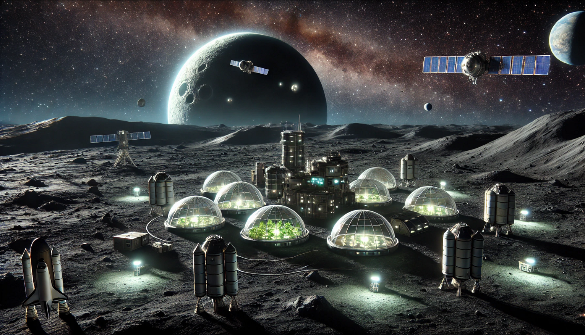

#TODO
a small overview of the mission with the group name, the summary of the business/scientific requirements of your mission, the constraints your project worked in (e.g., budget, time, performance, etc. ), the high-level choices and drivers for your architecture and the work plan you followed. Also, add a reflection (1 paragraph) on the workflow compared to a more ad-hoc workflow you started within the first lab session. 

# Dark Farmers

## Team 
Ahmad Shakleya, Berkay Yildirim, Rehmat Khan, Robbe Elsermans

## Mission 
Bring an experimental farm module on the dark side of Mun 🌑️ and provide constant communication 🛰️ with Kerbin 🌍️.

## System requirements
> written down in EARS Syntax

- Farm System (FS)
    - The FS shall use 0.29 EC/s​.
    - The FS shall weight 4000 kg​.
    - The FS shall always run.
    - The FS shall have no kerbins onboard.
    - The FS shall be self driven.
    - If the FS fails then the FS shall be abandoned.
    
- Transportation Vessel System (TVS)
    - The TVS shall be operated by a onboard computer
    - If the TVS fails to stage, then the TVS shall be abandoned.
    - When in orbit, the TVS searches for an appropriate trajectory to Mun.
    - When in transit from Kerbin to Mun, the TVS searches for an appropriate orbit around the Mun.
    - When around orbit of Mun, the TVS deploys the communication system(s).

- Communication System (CS)
    - WHEN an emergency is present, the CS shall work at 10 minutes interval.
    - WHEN in normal operation mode, the CS shall work at 30 minutes interval.
    - The CS shall be accessible at all times.
    - If the CS fails then the CS shall be abandoned.
    

- No return vessel nor re-usability of used components
- No kerbin onboard

## Constrains
**💵️Budget**
It is in the name of science! Ah, joking, everything in life costs money. Even if it could mean a change in history!

Below some tables that give the estimated value with the maximal budget we can use. 
Later, a table where each used component is linked with a certain category. 
Finally, a total cost of each category where a comparison is made between the estimated and the actual costs invested in the system.

| Category             | Funds (F) |
|----------------------|-----------|
| Farm Module          | 45000     |
| Satellite Network    | 12000     |
| Launch Vehicle       | 60000     |
| Transfer Stage       | 15000     |
| Contingency (15%)    | 16000     |

Total:	148000	F
The budget that was given is 160000-170000 funds. In our estimates, we try to sketch the total amount of usage.

Below the actual spending of our rocket
| Part                                            | Amount | Cost   | Category                | Sub-total |
|-------------------------------------------------|--------|--------|-------------------------|-----------|
| Mk2 Lander Can                                  | 3      | 3202   | Farm Module             | 9606      |
| Communotron 16                                  | 1      | 300    | Farm Module             | 300       |
| Z-4K Rechargeable Battery Bank                  | 6      | 4500   | Farm Module             | 27000     |
| OX-STAT Photovoltaic Panels                     | 2      | 70     | Farm Module             | 140       |
| Cubic Octagonal Strut                           | 7      | 16     | Contingency (15%)       | 112       |
| Octagonal Strut                                 | 1      | 20     | Contingency (15%)       | 20        |
| AE-FF2 Airstream Protective Shell               | 2.5    | 12     | Contingency (15%)       | 630       |
| CompoMax Radial Tubeless                        | 4      | 300    | Contingency (15%)       | 1200      |
| TD-06 Decoupler                                 | 3      | 150    | Contingency (15%)       | 450       |
| 48-7S "Spark" Liquid Fuel Engine                | 3      | 240    | Transfer Stage          | 720       |
| Oscar-B Fuel Tank                               | 3      | 70     | Satellite Network       | 210       |
| Z-200 Rechargeable Battery Bank                 | 9      | 360    | Satellite Network       | 3240      |
| OX-4W 3x2 Photovoltaic Panels                   | 6      | 380    | Satellite Network       | 2280      |
| Small Inline Reaction Wheel                     | 3      | 600    | Satellite Network       | 1800      |
| Communotron 16-S                                | 3      | 300    | Satellite Network       | 900       |
| Probodobodyne OKTO2                             | 3      | 1480   | Satellite Network       | 4440      |
| RA-2 Relay Antenna                              | 3      | 1800   | Satellite Network       | 5400      |
| 24-77 "Twitch" Liquid Fuel Engine               | 2      | 230    | Transfer Stage          | 460       |
| TD-25 Decoupler                                 | 1      | 300    | Transfer Stage          | 300       |
| Rockomax X200-32 Fuel Tank                      | 2      | 3000   | Transfer Stage          | 6000      |
| TS-25 Stack Separator                           | 1      | 400    | Transfer Stage          | 400       |
| Rockomax Jumbo-64 Fuel Tank                     | 1      | 5750   | Launch Vehicle          | 5750      |
| Mk-55 "Thud" Liquid Fuel Engine                 | 2      | 820    | Launch Vehicle          | 1640      |
| RC-L01 Remote Guidance Unit                     | 1      | 3400   | Transfer Stage          | 3400      |
| RE-M3 "Mainsail" Liquid Fuel Engine             | 1      | 13000  | Launch Vehicle          | 13000     |
| Delta-Deluxe Winglet                            | 5      | 600    | Launch Vehicle          | 3000      |
| TT-70 Radial Decoupler                          | 2      | 700    | Launch Vehicle          | 1400      |
| S2-33 "Clydesdale" Solid Fuel Booster           | 2      | 18500  | Launch Vehicle          | 37000     |
| Protective Rocket Nose Cone Mk7                 | 2      | 450    | Launch Vehicle          | 900       |
| EAS-4 Strut Connector                           | 39     | 42     | Contingency (15%)       | 1638      |
| TT18-A Launch Stability Enhancer                | 2      | 200    | Launch Vehicle          | 400       |
| LT-2 Landing Strut                              | 3      | 340    | Transfer Stage          | 1020      |

Total:	134756	F
budget leftover	25244	F

And per category with the difference in the estimation value.
(positive is leftover, negative is extra money needed)
| Category             | Funds (F) | Difference with Estimation |
|----------------------|-----------|----------------------------|
| Farm Module          | 37046     | 7954                       |
| Satellite Network    | 18270     | -6270                      |
| Launch Vehicle       | 63090     | -3090                      |
| Transfer Stage       | 12300     | 2700                       |
| Contingency (15%)    | 4050      | 11950                      |

More money did go in the Satellite Network setup and Launch Vehicle. Nevertheless, we spend less money on the other stages which is used in the 2 previously mentioned stages.

**⏳️Time**
- Must be on the dark side of the mun -> path planning
- Farm contents do not get impacted on long time space travel

**📈️Performance**
- A $\Delta V$ of 5922.5 m/s is needed to go from Kerbin to Mun accordingly to [KSP Delta-V Planner](https://ksp.loicviennois.com/).
    - *Side note: we've added a 15% margin to the theoretical value.*

## High-level choices
- Take 1 big rocket 🚀️ to carry the payload 📦️.
- 3 satellites 🛰️ in a triangular shape to provide global coverage around the Mun.
- No kerbin onboard and only guided by onboard controller.
- 10 minutes communication interval between the 2 locations.
- Full sustainable farm with no generators, only harvesters.
- 1 way ticket with no return vessels

## Workplan

## Reflection workflow
